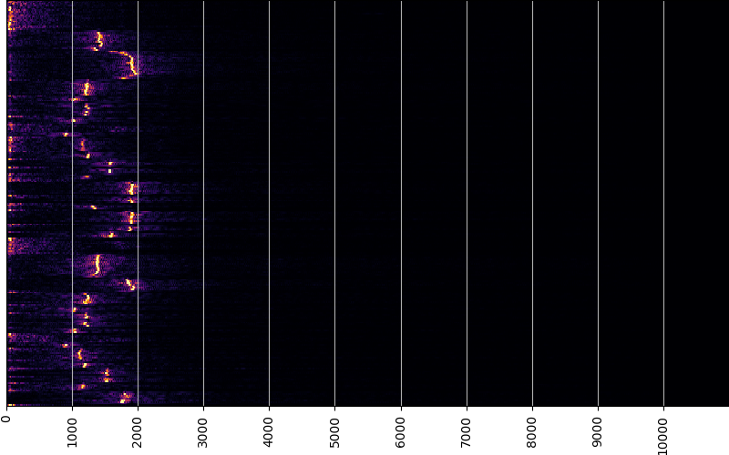

# 信号系统工具箱

这是一个无线电爱好者的学习实践

## 安装依赖
``` sh
git clone https://github.com/liangchen-harold/signal-tools.git
cd signal-tools
pip install -r requirement.txt
```

## 提供的工具

1. 频域瀑布图（信号源为声卡）



启动方式：

1.1. 命令行
``` sh
python waterfall.py

```

1.2. jupyter-lab 打开waterfall.ipynb